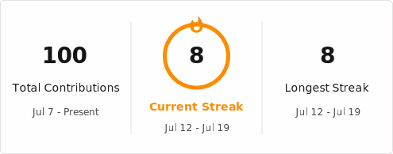

## Hi there 👋

- 🔭 I’m currently working on ...
- 🌱 I’m currently learning Python
- 📫 How to reach me: chitnisnathan@gmail.com
- 😄 Pronouns: he/him
- ⚡ Fun fact: I :heart: :dog:s
------------------------------
#### My Skills and more

|Category        | Skills        |
|-----------------|---------------|
|**Programming Languages**| 
|**Tools I use** |  
------------------------------
#### My Github Streak
<a href="https://git.io/streak-stats"></a>
------------------------------
<!--START_SECTION:waka-->


**🐱 My GitHub Data** 

> 📦 ? Used in GitHub's Storage 
 > 
> 🏆 100 Contributions in the Year 2026
 > 
> 🚫 Not Opted to Hire
 > 
> 📜 16 Public Repositories 
 > 
> 🔑 0 Private Repositories 
 > 
**I'm an Early 🐤** 

```text
🌞 Morning                9 commits           ████░░░░░░░░░░░░░░░░░░░░░   15.00 % 
🌆 Daytime                26 commits          ███████████░░░░░░░░░░░░░░   43.33 % 
🌃 Evening                25 commits          ██████████░░░░░░░░░░░░░░░   41.67 % 
🌙 Night                  0 commits           ░░░░░░░░░░░░░░░░░░░░░░░░░   00.00 % 
```
📅 **I'm Most Productive on Tuesday** 

```text
Monday                   7 commits           ███░░░░░░░░░░░░░░░░░░░░░░   11.67 % 
Tuesday                  15 commits          ██████░░░░░░░░░░░░░░░░░░░   25.00 % 
Wednesday                2 commits           █░░░░░░░░░░░░░░░░░░░░░░░░   03.33 % 
Thursday                 8 commits           ███░░░░░░░░░░░░░░░░░░░░░░   13.33 % 
Friday                   12 commits          █████░░░░░░░░░░░░░░░░░░░░   20.00 % 
Saturday                 6 commits           ██░░░░░░░░░░░░░░░░░░░░░░░   10.00 % 
Sunday                   10 commits          ████░░░░░░░░░░░░░░░░░░░░░   16.67 % 
```


📊 **This Week I Spent My Time On** 

```text
🕑︎ Time Zone: America/New_York

💬 Programming Languages: 
No Activity Tracked This Week

🔥 Editors: 
No Activity Tracked This Week

🐱‍💻 Projects: 
No Activity Tracked This Week

💻 Operating System: 
No Activity Tracked This Week
```

**I Mostly Code in Python** 

```text
Python                   2 repos             ███████░░░░░░░░░░░░░░░░░░   28.57 % 
HTML                     2 repos             ███████░░░░░░░░░░░░░░░░░░   28.57 % 
LLVM                     1 repo              ████░░░░░░░░░░░░░░░░░░░░░   14.29 % 
JavaScript               1 repo              ████░░░░░░░░░░░░░░░░░░░░░   14.29 % 
Ruby                     1 repo              ████░░░░░░░░░░░░░░░░░░░░░   14.29 % 
```


**Timeline**


 Last Updated on 20/07/2026 22:11:29 UTC
<!--END_SECTION:waka-->
------------------------------
